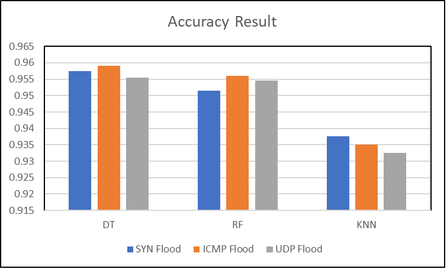

# Evaluation-of-ML-Models-Against-DDoS-Attacks-in-SDN
This project evaluates the effectiveness of Decision Tree (DT), Random Forest (RF), and k-Nearest Neighbours (KNN) machine learning algorithms in detecting SYN flood, ICMP flood, and UDP flood Distributed Denial-of-Service (DDoS) attacks within Software-Defined Networking (SDN) environments. 

# SDN Overview
Traditional network architecture struggles to support large, complex networks with many Internet-connected devices, leading to significant maintenance efforts. SDN addresses these limitations by restructuring the network into three distinct planes: management, control, and data. Through centralized control, SDN allows dynamic management of network traffic, making the network more flexible and adaptable. In SDN, software directs traffic between devices, in contrast to traditional networks, where switches and routers handle traffic control through hardware. In an SDN setup, the data plane is managed by the SDN switch, while the control plane is managed by a central controller, which acts as the network's main decision-maker.

# Vulnerability and Machine Learning Approach
The centralized control model of SDN introduces a vulnerability to DDoS attacks, such as SYN flood, ICMP flood, and UDP flood. Selecting the right machine learning algorithm to detect these attacks effectively is critical. To address this, we evaluated three machine learning algorithmsDT, RF, and KNN in a emulated SDN environment created with Mininet and the Ryu controller. Each algorithm was tested against SYN flood, ICMP flood, and UDP flood attacks, alongside normal traffic, with 1000 instances per attack type and benign traffic.

# Environment Setup
Our setup used Ubuntu 20.04 LTS, Mininet V2.3.0, and Open vSwitch (OVS) V2.13.1. Miniconda V24.1.2 was utilized to downgrade Python from version 3.12 to 3.8 to meet compatibility requirements for the emulation environment. We also installed Ryu, a Python-supported SDN controller. [click here](https://github.com/dz43developer/sdn-network-ddos-detection-using-machine-learning) to download preset OVA file for the environment setup provided by dz43developer. [click here](https://shantoroy.com/sdn/sdn-mininet-ryu/) to find step by step manual installation Guide.

# Results
The Decision Tree (DT) algorithm demonstrated strong accuracy in detecting SYN flood and ICMP flood attacks, while both DT and Random Forest (RF) performed similarly well in identifying UDP flood attacks. A detailed comparison of results is shown in the accompanying figure.

  
   
  <em>Figure 1: SHAP's Beeswarm Plot </em>

